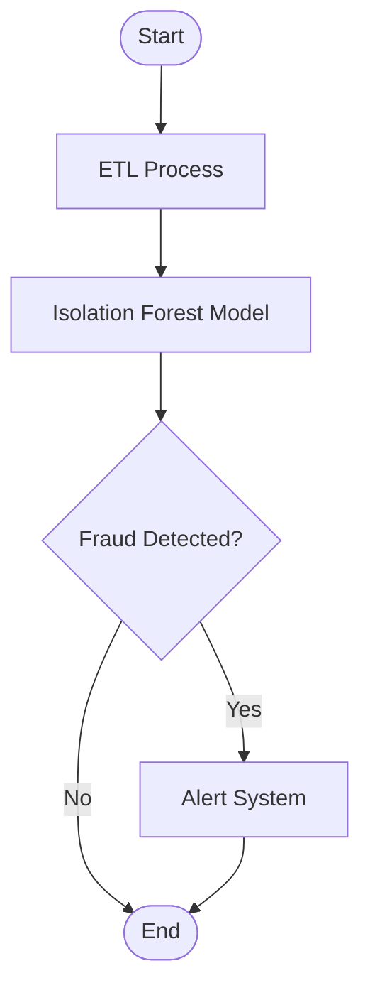
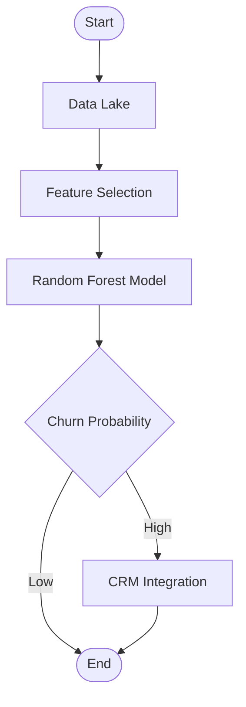
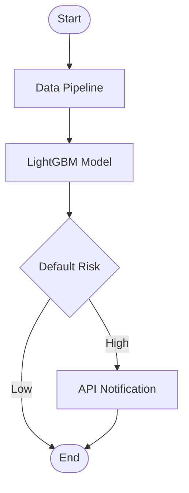
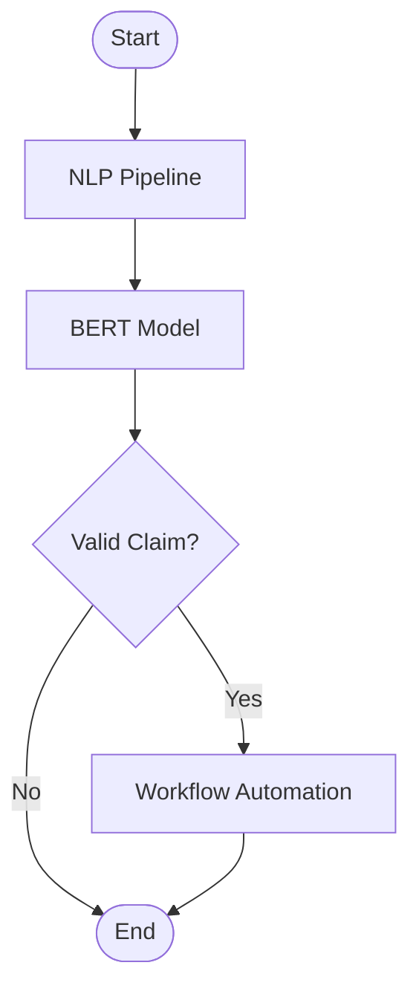
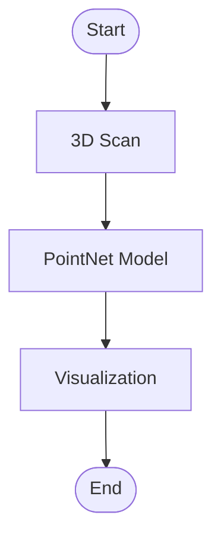
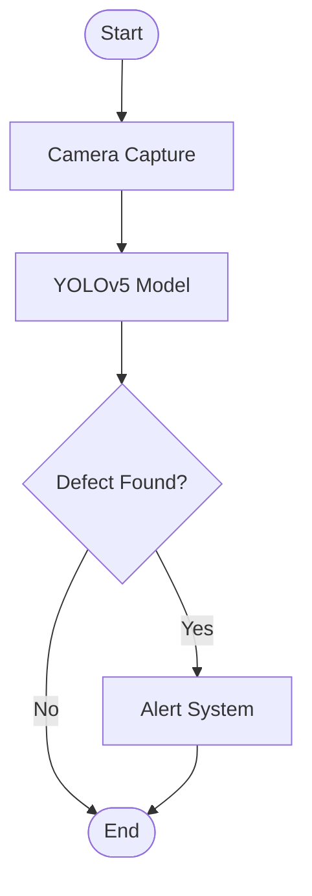
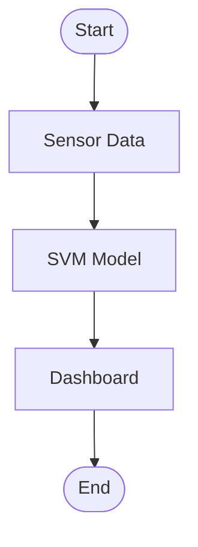
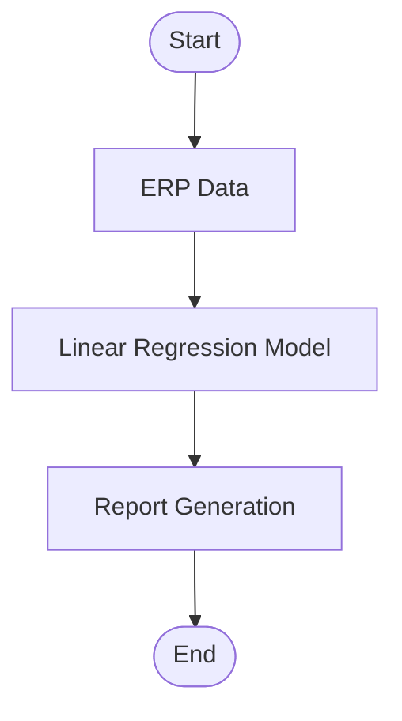
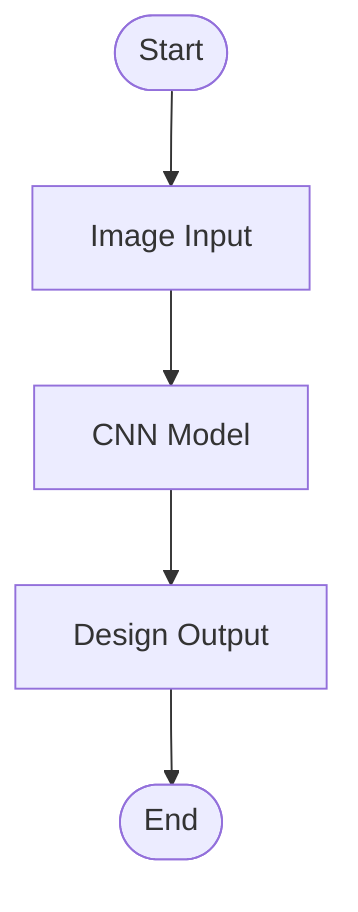

# BFSI & Fabric AI Projects

This repository contains AI project ideas, architectures, and future improvement possibilities for the Banking, Financial Services, Insurance (BFSI) and Fabric Manufacturing industries.

---

## BFSI Industry

### Project List
| Project Name                | Model Name         | Library Used   | Industry Segment         |
|----------------------------|--------------------|----------------|-------------------------|
| Credit Risk Prediction      | XGBoost            | scikit-learn   | Banking                 |
| Fraud Detection             | Isolation Forest   | PyTorch        | Financial Services      |
| Customer Churn Prediction   | Random Forest      | TensorFlow     | Insurance               |
| Loan Default Forecasting    | LightGBM           | LightGBM       | Banking                 |
| Claims Automation           | BERT               | HuggingFace    | Insurance               |

### Architectures
| Project Name                | Model Name         | Library Used   | Architecture Overview   |
|----------------------------|--------------------|----------------|-------------------------|
| Credit Risk Prediction      | XGBoost            | scikit-learn   | Data Ingestion → Model → Dashboard |
| Fraud Detection             | Isolation Forest   | PyTorch        | ETL → Model → Alert System         |
| Customer Churn Prediction   | Random Forest      | TensorFlow     | Data Lake → Model → CRM Integration|
| Loan Default Forecasting    | LightGBM           | LightGBM       | Data Pipeline → Model → API        |
| Claims Automation           | BERT               | HuggingFace    | NLP Pipeline → Model → Workflow    |
## BFSI Project Architectures (Flowcharts)

### Credit Risk Prediction
```mermaid
flowchart TD
	A([Start]) --> B[Data Ingestion]
	B --> C{Data Quality Check}
	C -- Pass --> D[Feature Engineering]
	C -- Fail --> E([End])
	D --> F[Model Training (XGBoost)]
	F --> G{Model Evaluation}
	G -- Good --> H[Dashboard]
	G -- Poor --> D
	H --> I([End])
```

### Fraud Detection


### Customer Churn Prediction


### Loan Default Forecasting


### Claims Automation


---

## Manufacturing (Fabric Industry)

### Project List
| Project Name                | Model Name         | Library Used   | Application Area        |
|----------------------------|--------------------|----------------|-------------------------|
| Fabric 3D Modeling          | PointNet           | PyTorch3D      | Fabric Industry         |
| Defect Detection (YOLO)     | YOLOv5             | Ultralytics    | Quality Control         |
| Quality Control Automation  | SVM                | scikit-learn   | Quality Control         |
| Raw Material Optimization   | Linear Regression  | TensorFlow     | Consumables Saving      |
| Pattern Recognition         | CNN                | Keras          | Fabric Design           |
## Fabric Project Architectures (Flowcharts)

### Fabric 3D Modeling


### Defect Detection (YOLO)


### Quality Control Automation


### Raw Material Optimization


### Pattern Recognition


### Architectures
| Project Name                | Model Name         | Library Used   | Architecture Overview   |
|----------------------------|--------------------|----------------|-------------------------|
| Fabric 3D Modeling          | PointNet           | PyTorch3D      | 3D Scan → Model → Visualization    |
| Defect Detection (YOLO)     | YOLOv5             | Ultralytics    | Camera → Model → Alert System      |
| Quality Control Automation  | SVM                | scikit-learn   | Sensor → Model → Dashboard         |
| Raw Material Optimization   | Linear Regression  | TensorFlow     | ERP → Model → Report               |
| Pattern Recognition         | CNN                | Keras          | Image Input → Model → Design Output|

---

## Future Improvement Possibilities

### BFSI Industry
- Enhanced Explainability for AI Models
- Real-time Data Integration
- Advanced NLP for Customer Service
- Federated Learning for Data Privacy
- Automated Regulatory Compliance

### Manufacturing (Fabric)
- Edge AI for Real-time Quality Control
- Generative AI for Fabric Design
- Predictive Maintenance using IoT
- AI-driven Supply Chain Optimization
- Integration with Robotics for Automation
